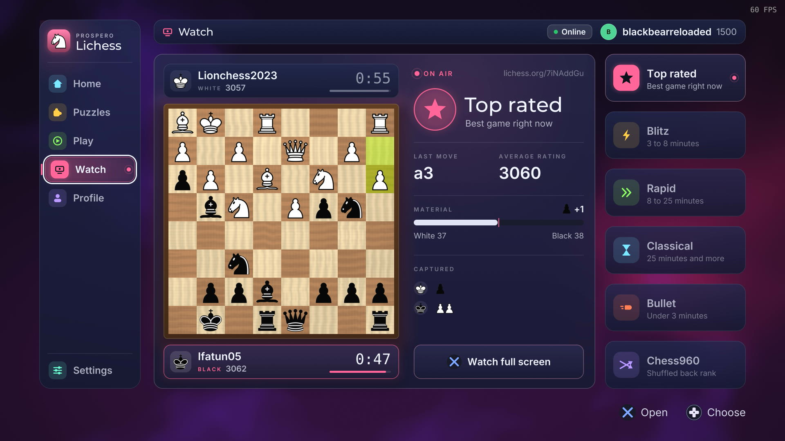

<p align="center">
  
</p>

<h1 align="center">ProsperoLichess</h1>

<p align="center">
  <strong>A native Lichess client for PlayStation 5 homebrew</strong><br>
  Play online, train with puzzles and watch live games from the couch, with a
  board rendered in OpenGL 4.6 and controls built for the DualSense.
</p>

<p align="center">
  
  
  
  
  <a href="LICENSE"></a>
</p>



The picture shows the Watch page running on a PlayStation 5, with a live game from Lichess TV.

> [!NOTE]
> The current version is `01.000.000`: see the
> [releases](https://github.com/blackbearreloaded/ProsperoLichess/releases) and the
> [changelog](CHANGELOG.md).

> [!IMPORTANT]
> ProsperoLichess includes its exact-title one-shot
> [Lapy](https://github.com/mpereiraesaa/PS5-Lapy-JB-Daemon) helper. The
> jailbreak environment only needs a local ELF loader on TCP port 9021; a
> separately loaded resident Lapy service is optional.

## Highlights

- **Lichess on your TV:** play rated or casual games against people, challenge Stockfish
  at eight levels, resume your ongoing and correspondence games, and watch
  Lichess TV. Moves go straight to lichess.org through its public Board API.
- **Sign in with your phone:** scan a QR code, authorize on Lichess and the
  console signs itself in. A personal API token typed on the on-screen keyboard
  works too.
- **Puzzles online and offline:** the Daily Puzzle and rated Puzzle Training
  come from Lichess; Puzzle Streak, Puzzle Storm and Puzzle Themes run offline
  on a built-in pack of 101,888 puzzles across 73 themes.
- **Pass & Play:** two players on one controller, with the board turning to
  face the side on move and the game saved as you play.
- **Your board, your pieces:** wood, marble or flat boards, the cburnett,
  merida and chessnut piece sets, coordinates, legal-move dots, premoves and
  promotion choices.
- **Sound and feel:** 66 sound effects for moves, captures, checks, results
  and the interface, a four-song soundtrack, and controller vibration on
  captures, checks and results, each with its own setting.
- **Motion everywhere:** an opening title, animated screen transitions,
  pieces dealt onto the board, gliding moves, capture bursts and check and
  checkmate ripples, at 4K and 60 frames per second.
- **In your language:** the app speaks the language the console is set to.
  Besides English: Arabic, Chinese (Simplified and Traditional), Czech,
  Danish, Dutch, Finnish, French (France and Canada), German, Greek,
  Hungarian, Indonesian, Italian, Japanese, Korean, Norwegian, Polish,
  Portuguese (Brazil and Portugal), Romanian, Russian, Spanish (Spain and
  Latin America), Swedish, Thai, Turkish, Ukrainian and Vietnamese, with the
  chess words lichess.org uses in each. See [Languages](docs/LANGUAGES.md).
- **A console interface with a look of its own:** a rail down the left with
  the app's mark and a sign for every page, a colour and a sky for each part
  of the app, lit panels, ratings drawn as lines over time, a focus that
  glides and screens that assemble, frosted dialogs, and controller hints on
  every screen. See [the house look](docs/LOOK.md) and
  [the interface notes](docs/UI.md).

> [!IMPORTANT]
> ProsperoLichess does not run on an unmodified retail console. It is intended
> for consoles you own with an already configured, compatible homebrew loader.
> Online modes need a Lichess account and an internet connection.

## Modes

| Group | Mode | Needs |
| --- | --- | --- |
| Puzzles | Daily Puzzle | Internet |
| Puzzles | Puzzle Training (rated when signed in) | Internet |
| Puzzles | Puzzle Streak, Puzzle Storm, Puzzle Themes | Nothing (offline pack) |
| Play | Online (rapid or classical, rated or casual) | Lichess account |
| Play | Computer (Stockfish on Lichess, 8 levels) | Lichess account |
| Play | Friend: Pass & Play on one controller | Nothing (offline) |
| Watch | Lichess TV, six channels | Internet |
| Profile | Your ratings and games in progress (ongoing and correspondence) | Lichess account |

> [!NOTE]
> ProsperoLichess is an unofficial client. It uses the public
> [Lichess API](https://lichess.org/api) and is not affiliated with or endorsed
> by Lichess. Online modes need the console to reach lichess.org; puzzle
> Streak, Storm and Themes and Pass & Play work offline.

## Project foundation

> [!IMPORTANT]
> **Built on the [PS5 Native App Boilerplate](https://github.com/blackbearreloaded/ps5-native-app-boilerplate).**
> ProsperoLichess keeps the template's C++20 structure, reproducible runtime,
> native FSELF tooling, tests, safe folder deployment and release automation.

> [!IMPORTANT]
> **Rendering uses [ps5-opengl](https://github.com/blackbearreloaded/ps5-opengl).**
> The app creates an OpenGL 4.6 Core context through EGL and links the
> ps5-opengl SDK statically. The SDK release is pinned by version and checksum
> in [`tools/fetch-opengl-sdk.sh`](tools/fetch-opengl-sdk.sh); see
> [OpenGL integration](docs/OPENGL_INTEGRATION.md).

Once per launch the app asks homebrew.page whether a newer release is listed
(one HTTPS GET of `https://homebrew.page/api/v1/apps/PPSA99009.json`, without
your Lichess token). A signed update offer opens an animated install dialog.
Folder installs can download, verify, unpack and replace themselves in place;
package-image installs retain the manual update path below.

Networking uses libcurl with OpenSSL (from PacBrew) over the console's own
sockets and certificate list, with the system HTTP service kept as a fallback;
the chess rules, move generation and notation are implemented in `src/chess/`.

| Identity | Value |
| --- | --- |
| Shell title | `ProsperoLichess` |
| Title ID | `PPSA99009` |
| Category | Game |
| Current version | `01.000.000` |
| Version source | [`sce_sys/param.json`](sce_sys/param.json) |
| Writable data | `/data/prosperolichess` (`/download0/prosperolichess` fallback) |

## Requirements

Build from Linux, WSL, or a Linux CI runner. On Ubuntu, Debian, or WSL:

```bash
sudo apt update
sudo apt install curl git make pkg-config python3 python3-venv tar unzip wget \
  clang-18 clang-format-18 clang-tidy-18 lld-18 ninja-build ccache libcurl4-openssl-dev
make doctor
```

The build downloads and verifies the public PS5 Payload SDK, zlib, GoogleTest,
the ps5-opengl SDK and packaging tools below ignored `.deps/` directories.
Nothing is installed globally by the project build. See
[Getting started](docs/GETTING_STARTED.md) and
[Native tooling](docs/NATIVE_TOOLING.md) for clean-machine setup details.
`libcurl4-openssl-dev` is only for host tests and host snapshots.

## Build

```bash
# Title folder and its ZIP: what CI builds and a release carries.
make

# Optional compressed image, for local use only.
make ffpfsc
```

Outputs are written to:

```text
dist/PPSA99009/           complete title folder
dist/PPSA99009.zip        folder archive
dist/PPSA99009.ffpfsc     compressed image (make ffpfsc only)
```

Useful development gates are:

```bash
make test            # host GoogleTest and integration tests
make lint            # formatting, static analysis, metadata, asset and shell checks
make check           # lint + every host test + complete folder build
make host-snapshots  # render screens on the host
make audio-check     # validate sound effects
```

Other asset tools: `tools/bake-pieces.py` (piece atlases),
`tools/build-puzzle-pack.py` (offline puzzles, see
[tools/PUZZLE_PACK.md](tools/PUZZLE_PACK.md)), `tools/process-sfx.py` (sound
effects) and `tools/render-art.sh` (icon and backgrounds).

## GitHub Actions and releases

The [Build workflow](.github/workflows/tooling.yml) runs on every pull request,
version tag, and manual dispatch (pushes to `main` build nothing). It lints, runs the host
tests, reproduces `runtime/libc.prx`, builds `PPSA99009.zip`,
and writes `SHA256SUMS` for it. A pull request's build is named by
its number and commit: see [Pull-request builds](docs/PULL_REQUEST_BUILDS.md).

The workflow also holds a step that signs the ZIP's build provenance; it is skipped while this
repository is private. Once this repository is public, a release ZIP built by the workflow can
be checked with `gh attestation verify PPSA99009.zip -R blackbearreloaded/ProsperoLichess` (GitHub CLI);
that covers releases built by GitHub Actions from then on, not earlier ones.

Pushing a tag equal to `contentVersion` publishes a GitHub Release with those
files, built from the tagged commit. A build on `main` is started by hand
(**Actions**, **Build**, **Run workflow**) and publishes nothing.

## Install or update

1. Download `PPSA99009.zip` from a GitHub release and verify it with
   `SHA256SUMS`.
2. Fully close ProsperoLichess.
3. Extract `PPSA99009.zip` and upload its complete `PPSA99009` directory to
   `/data/homebrew/`, producing `/data/homebrew/PPSA99009/eboot.bin`. Do not
   upload the ZIP itself.
4. Restart ShadowMountPlus cleanly or restart the PS5, then wait for
   ShadowMountPlus to rediscover the title before launching it.

Keeping the title ID as `PPSA99009` preserves your sign-in, saved games and
settings in `/data/prosperolichess`.

For a folder install, the in-app **Update now** path downloads the release ZIP,
verifies its catalog SHA-256, unpacks it beside the app, and hands the final
atomic replacement to `self-updater.elf`. The app closes only after the helper
accepts the job. Circle cancels before replacement; failures leave the current
installation untouched and offer a retry. Fully close and manually replace
`.ffpfsc` images because a mounted image cannot update itself in place.

## Deploy

For an already-running PS5 FTP service, stage the development folder with:

```bash
make deploy PS5_HOST=192.168.1.100
```

Fully close ProsperoLichess before deploying. See
[Deployment](docs/DEPLOYMENT.md) for the development loop and removal.
Unattended hardware tours place a controller script at
`assets/test/script.txt` in the deployed folder (see
[tests/hardware/tour.txt](tests/hardware/tour.txt)); release builds contain none.

## Signing in

Open Profile in the side rail and choose Sign in. ProsperoLichess shows a QR
code: scan it with a phone on the same network, sign in to Lichess and press
Authorize, and the console finishes signing in on its own. It uses Lichess
OAuth with PKCE, so your password never touches the console. Choose "Use a
token instead" to type a
[personal API token](https://lichess.org/account/oauth/token) with the
on-screen keyboard; it is masked as you type. Sign out from Profile by holding
the Sign out button.

## Controls

| Where | Input | Action |
| --- | --- | --- |
| Home screen | D-pad / left stick, Cross | Move and choose |
| Home screen | Options | Hand the controller to the side rail |
| Home screen | Touchpad | Open the game that waits for your move (the bell at the top right) |
| Puzzles page | L1 / R1 | Switch between Modes and Themes |
| Play page | L1 / R1 | Switch between Online, Computer and Friend |
| Board | Cross | Select a piece or make a move |
| Board | L1 / R1 | Jump to the previous / next piece |
| Board | L2 / R2 | Step back and forward through the game |
| Game | Triangle | Actions: offer a draw, ask for a takeback, undo, flip the board |
| Game | Square (hold) | Resign |
| Game | Options | Game menu |
| Puzzles | Triangle / Square | Hint / show the solution (skip once in Streak) |
| Lichess TV | L1 / R1, Square | Change channel, flip the board |
| Anywhere | Circle | Back |

Every screen shows what the buttons do at the bottom right. Settings cover
board, pieces, coordinates, legal-move dots, auto-queen, premoves, resignation
confirmation, vibration, three volume sliders, reduced motion, swapping Cross
and Circle, an FPS counter and the rendering resolution, with a live preview
of the board.

## Audio

Sound effects live in `assets/audio/sfx/chess/` (the interface cues this set
does not record come from `assets/audio/sfx/glass/`); `tools/process-sfx.py`
trims and levels raw clips. The music player plays every OGG song in
`assets/audio/music/` in a new shuffled order at each launch; four songs
generated with ElevenLabs Music ship with the app. Convert songs with `tools/prepare-music.sh <folder>` (OGG, 48 kHz,
-18 LUFS). The home-screen selection music is `sce_sys/snd0.at9`, an ATRAC9
loop; create or replace it with
[ps5-at9-converter](https://github.com/blackbearreloaded/ps5-at9-converter).

## Source layout

```text
src/main.cpp            display, input, audio and frame loop
src/app/                scene stack, status bar and what every screen shares
src/modes/              home screen with its side rail and pages; game, puzzle,
                        TV and sign-in screens
src/chess/              rules, move generation and notation
src/board/              board renderer, piece atlases and board input
src/lichess/            Lichess session, Board API link and puzzle sources
src/puzzles/            offline puzzle pack reader
src/net/                HTTP client, NDJSON streams, OAuth PKCE and callback listener
src/ui/                 themes, widgets and the component library (ps5-homebrew-ui), QR code
src/gfx/                OpenGL 4.6 renderer: draw list, backdrops, frosted glass, fonts
src/audio/              mixer, sound cues and music playlist
src/core/               input, saves, settings and version
src/platform/ps5/       EGL display, DualSense, AudioOut and the console HTTP service
src/third_party/        yyjson, qrcodegen and stb_vorbis
third_party/            typefaces, piece set SVGs and host-only stb headers
assets/                 fonts, piece atlases, puzzle pack and sound effects
sce_sys/                param.json, icon, backgrounds and selection music
host/                   host snapshot renderer
tests/                  GoogleTest and Python host tests
docs/                   architecture, setup, testing and integration notes
```

## Versioning

[`sce_sys/param.json`](sce_sys/param.json) is the only application identity and
release-version source. Its PS5-format `contentVersion` is read at startup and
shown on the home screen, and the release workflow uses it as the tag and
release name. Do not add a `v` prefix.

To publish a version, raise `contentVersion` (for example to `01.001.000`),
pass the local gates, push to `main`, and push a tag equal to `contentVersion`;
GitHub Actions builds and releases it.

Keep `PPSA99009`, `conceptId` and `contentId` stable for updates to this title.
Changing the title ID creates a separate PS5 application with separate saves.
See [Configuration](docs/CONFIGURATION.md).

## Documentation

| Document | Purpose |
| --- | --- |
| [Getting started](docs/GETTING_STARTED.md) | Clean-machine prerequisites and first build |
| [Architecture](docs/ARCHITECTURE.md) | Shell, modes, rendering and audio flow |
| [Interface](docs/UI.md) | How screens are built on the UI kit, and how to look at them |
| [The house look](docs/LOOK.md) | The app's design language: colour per part, lit panels, charts, motion |
| [Languages](docs/LANGUAGES.md) | How the language is chosen, marking text, catalogs, fonts |
| [Configuration](docs/CONFIGURATION.md) | Identity, versioning and build variables |
| [OpenGL integration](docs/OPENGL_INTEGRATION.md) | SDK selection and rendering rules |
| [Offline puzzle pack](tools/PUZZLE_PACK.md) | Puzzle source, selection and rebuild |
| [Testing](docs/TESTING.md) | Host tests, and the scripted runs on a console |
| [Pull-request builds](docs/PULL_REQUEST_BUILDS.md) | An installable build per pull request: its artifact name, its label file, how to get it |
| [Deployment](docs/DEPLOYMENT.md) | Safe folder and image staging |
| [Troubleshooting](docs/TROUBLESHOOTING.md) | Common build, launch and runtime failures |
| [Platform notes](docs/PLATFORM_NOTES.md) | PS5 filesystem, loader and presentation constraints |
| [Runtime shim](docs/RUNTIME_SHIM.md) | `libc.prx` scope and reproduction |
| [Presentation assets](docs/PRESENTATION_ASSETS.md) | Icon, backgrounds and selection audio |
| [Contributing](CONTRIBUTING.md) | Change, test and release requirements |
| [Notices](THIRD_PARTY_NOTICES.md) | Dependency, asset and license attribution |

<!-- bbr-footer:start -->
<!-- Generated by ps5-homebrew-dev-protocol/scripts/readme-footer. Edit the template there, not here. -->

## Credits

Built with the [PS5 Payload SDK](https://github.com/ps5-payload-dev/sdk) by John Törnblom (ps5-payload-dev).
Third-party components, authors and licenses are listed in
[THIRD_PARTY_NOTICES.md](THIRD_PARTY_NOTICES.md).

## License

Copyright © 2026 BlackBearReloaded. Licensed under GPL-3.0-or-later; see [LICENSE](LICENSE). Third-party components keep their own licenses.

## Disclaimer

- **No affiliation.** This is an independent homebrew project. It is not
  affiliated with, endorsed by, or sponsored by Sony Interactive Entertainment.
  "PlayStation", "PS5" and related marks are trademarks of Sony Interactive
  Entertainment Inc. This project is not affiliated with or endorsed by Lichess.
- **No proprietary material.** No Sony SDK, firmware, encryption keys or
  decrypted system modules are included.
- **No warranty.** This project is provided "as is", without warranty of any
  kind, to the extent permitted by law. See sections 15 and 16 of the GPL.
- **Use at your own risk.** Running homebrew requires a modified console, which
  may void its warranty, breach the platform's terms of service, or cause data
  loss.
- **Legal use only.** Use it only with hardware, accounts and content you own.
  This project does not support or enable piracy.

## AI assistance

This project was developed with AI assistance from OpenAI and/or Anthropic tools.
<!-- bbr-footer:end -->
